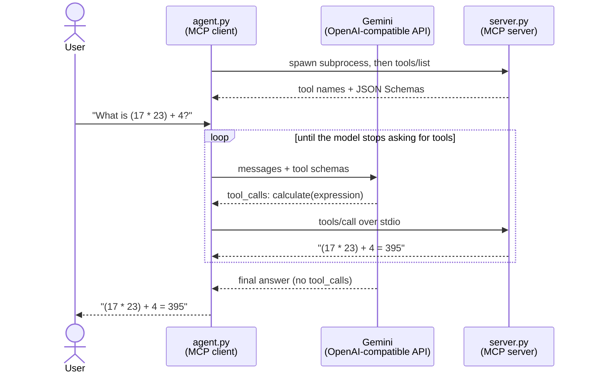

# MCP Demo: A Gemini Agent That Calls MCP Tools

The [Model Context Protocol](https://modelcontextprotocol.io) (MCP) is an open standard
for connecting LLM applications to external tools and data. Instead of every app
inventing its own plugin format, an MCP **server** declares what it can do — each
tool's name, description, and a JSON Schema for its arguments — and any MCP
**client** can discover and invoke those tools over a standard transport. This repo
is a deliberately small, readable reference implementation of both halves: a server
(`server.py`) exposing four trivial tools, and an agent (`agent.py`) that connects to
it, hands the tool list to Google Gemini, lets the model decide what to call, executes
the calls against the server, and feeds the results back until the model produces a
final answer. Two files, no framework, no database — the point is that you can read
the whole request/response cycle end to end in one sitting.

## Architecture



In plain terms:

```
User -> Agent -> Gemini (decides which tool) -> Agent -> MCP Server (executes it)
                    ^                                          |
                    +--------- result fed back ----------------+
                                     |
                                     v
                            final answer -> User
```

The agent launches the server as a **subprocess** and talks to it over stdio
(JSON-RPC on stdin/stdout). Nothing listens on a network port; the only outbound
traffic is to the Gemini API.

## The tools

All four live in [server.py](server.py). Their JSON Schemas are generated from the
Python type hints, and their descriptions come from the docstrings — that is what the
model reads when deciding what to call.

| Tool | Input | Output |
|---|---|---|
| `calculate` | `expression: str` — arithmetic like `"(17 * 23) + 4"` | `"(17 * 23) + 4 = 395"` |
| `get_current_time` | `timezone: str = "UTC"` — an IANA name like `"Asia/Karachi"` | `"2026-08-11 14:44:43 PKT (Asia/Karachi)"` |
| `add_note` | `text: str` — the note to save | `"Saved note #1: buy milk"` |
| `list_notes` | *(none)* | numbered list of notes, or `"No notes saved yet."` |

Notes:

- **`calculate` does not use `eval()`.** The expression is parsed to an AST and only
  whitelisted numeric operations are evaluated. Tool arguments originate from an LLM
  reacting to untrusted user text, so treating them as untrusted input matters.
- **Notes are in-memory**, held in a list inside the server process. They live as long
  as one `agent.py` session and then vanish. No database is needed for the demo;
  swapping the list for SQLite would not change a single line of the agent.
- Invalid input (bad expression, unknown timezone, empty note) raises, which MCP
  reports as a tool error. The agent forwards that text to the model, which usually
  corrects itself and retries. Both the success and the error path are handled.

## Setup

Requires Python 3.10+ and a Google AI Studio API key.

```bash
git clone https://github.com/mallahim01/MCP-server
cd MCP-server

# 1. Create and activate a virtual environment
python -m venv .venv
.venv\Scripts\activate        # Windows
# source .venv/bin/activate   # macOS / Linux

# 2. Install dependencies
pip install -r requirements.txt

# 3. Configure your key
copy .env.example .env        # Windows  (cp on macOS/Linux)
# then edit .env and set GEMINI_API_KEY
```

Get a free key at [aistudio.google.com/apikey](https://aistudio.google.com/apikey).
`.env` is gitignored so your key never leaves your machine.

`.env` variables:

| Variable | Required | Default | Notes |
|---|---|---|---|
| `GEMINI_API_KEY` | yes | — | Your Google AI Studio key |
| `GEMINI_MODEL` | no | `gemini-flash-latest` | Any model your key can use that supports tool calling |

## Running it

One command — the agent starts the MCP server for you:

```bash
python agent.py "what is 17 * 23 + 4?"     # one-shot
python agent.py                            # interactive chat
```

You never run `server.py` yourself. In interactive mode the server subprocess and the
conversation history both stay alive across questions, which is what makes the notes
tool useful.

### Example 1 — a question that needs a tool

```
$ python agent.py "What is (17 * 23) + 4?"
Connected to MCP server 'demo-tools'.
Model: gemini-flash-latest
Tools: calculate, get_current_time, add_note, list_notes

You: What is (17 * 23) + 4?
  [tool] calculate({"expression": "(17 * 23) + 4"})
  [tool] -> (17 * 23) + 4 = 395

Assistant: (17 * 23) + 4 = 395
```

The model recognised the question as arithmetic, emitted a `calculate` tool call, the
agent executed it against the MCP server, and the model turned the result into prose.

### Example 2 — two tools in one turn

```
$ python agent.py "Save a note that says 'buy milk', then list all my notes."
  [tool] add_note({"text": "buy milk"})
  [tool] -> Saved note #1: buy milk
  [tool] list_notes({})
  [tool] -> 1. buy milk

Assistant: I've saved your note. Here are your notes:
1. buy milk
```

Two round trips: the model called `add_note`, read the result, then called
`list_notes` before answering. The loop keeps going until the model stops asking
for tools.

### Example 3 — no tool needed

```
$ python agent.py "What is the capital of France?"

Assistant: The capital of France is Paris.
```

No `[tool]` lines: the model answered directly. Handling this case is a one-line
branch in the agent, but it is the case people forget.

## How it works

The whole flow is in [`run_turn()`](agent.py). Two protocols meet here, and the
interesting part is how little glue they need.

**Startup.** `agent.py` spawns `server.py` with `sys.executable` and wraps its stdio
pipes in an MCP `Client`. Entering the client performs the MCP handshake. It then
calls `list_tools()` — the tool list is *discovered*, never hardcoded, so adding a
tool to the server is all it takes for the agent to start offering it.

**The bridge.** `mcp_tool_to_openai_schema()` is the entire translation layer between
the two standards. An MCP tool already carries `name`, `description`, and
`input_schema` (JSON Schema); OpenAI's `tools` parameter wants the same three things
nested under a `"function"` key. That is a five-line function, and it is why MCP tools
work with any tool-calling model.

**The loop.** For each user turn, up to `MAX_TURNS` times:

1. Send the conversation plus every tool schema to Gemini.
2. If the reply has **no** `tool_calls`, that is the final answer — return it.
3. Otherwise, for each requested call: parse the JSON arguments, invoke
   `mcp_client.call_tool(name, args)`, and flatten the MCP content blocks to text.
   A tool that raises comes back with `is_error` set; the error text is passed to the
   model rather than crashing, so it can fix its arguments and retry.
4. Append one `role: "tool"` message per call — **every** `tool_call_id` must be
   answered or the next request is rejected — and loop.

The `MAX_TURNS` cap is a safety net: a confused model could otherwise call tools
forever.

**One Gemini quirk.** Gemini's newer models attach an opaque `thought_signature` to
each tool call and require it to be echoed back in the follow-up request; dropping it
is a `400`. It is not part of the OpenAI spec, so the SDK parks it in `model_extra`,
and `_serialize_tool_call()` copies it through. Against real OpenAI the field is
simply absent and the same code works unchanged. This is the kind of detail that only
shows up when you actually run the thing.

## Project layout

```
server.py         MCP server + the four tool definitions
agent.py          MCP client + the Gemini tool-calling loop
requirements.txt  mcp, openai, python-dotenv, tzdata
.env.example      template for your API key
.env              your real key (gitignored, never committed)
```

## Notes and limitations

This is a teaching example, not a production system. It has no authentication, no
persistence, no retries, and no observability, all deliberately. A few things worth
knowing if you run it:

- The free Gemini tier is quota-limited both **per minute** and **per day**, per
  model (at the time of writing, 5/min and 20/day for the default model), and a
  single question costs one request per tool-calling round — so a two-tool question
  costs three. The agent reports a `429` as a plain message rather than a traceback.
  If you exhaust the daily quota, set `GEMINI_MODEL` to a different model; the
  quotas are counted per model.
- `tzdata` is in the requirements because Windows ships no IANA timezone database,
  which `get_current_time` needs. On Linux/macOS it is usually redundant but harmless.
- This uses **v2** of the MCP Python SDK (`MCPServer`, `Client`). The v1 API
  (`FastMCP`, `ClientSession` + `stdio_client`) is different; if you are following an
  older tutorial, that is why the imports do not match.

## License

MIT
